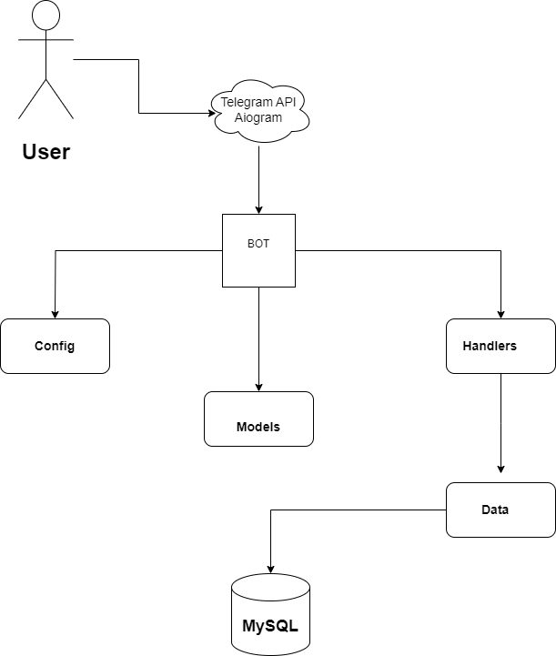

# CryptoAnalyzerBot Documentation

## Developer Documentation

### Содержание
1. [Обзор архитектуры](#обзор-архитектуры)
2. [Структура каталогов](#структура-каталогов)
3. [Классы и функции](#классы-и-функции)
4. [Методология тестирования](#методология-тестирования)
5. [Функциональные результаты](#функциональные-результаты)
6. [Требования к среде](#требования-к-среде)

### Обзор архитектуры
CryptoAnalyzerBot предназначен для выполнения анализа паттернов и технического анализа данных криптовалют. Основные компоненты системы включают анализ данных, генерацию диаграмм и обработку уведомлений. Эти компоненты взаимодействуют с внешними API и библиотеками для получения данных, их обработки и предоставления информативных визуализаций и уведомлений пользователю.

#### Диаграмма компонентов

- 

#### Структура каталогов

```plaintext
CryptoAnalyzerBot/
│
├── .env                # Переменные среды
├── base.py             # Базовые handler
├── bot.py              # Main bot логика
├── config.py           # Configuration settings
├── requirements.txt    # Required Python packages
├── TA_Lib-0.4.29-cp39-cp39-win_amd64.whl  # TA-Lib library for Python
│
├── data/               # Модули обработки данных
│   ├── analysis.py # Анализ данных для пар криптовалют
│   ├── news.py # Новости
│
├── handlers/           # Обработчики для различных функций бота
│   ├── __init__.py
│   ├── analysis_handler.py
│   ├── notifications_handler.py
│   ├── news_handler.py
│
```
## Классы и функции

#### base.py

&emsp;**Описание:** Обработка обработчиков базовых кнопок.  
&emsp;**Функции:**  
&emsp;&emsp;`start_command()`: Обработка команд /start  
&emsp;&emsp;`help_command()`: Обработка команд /help


#### bot.py

&emsp;**Описание:** Содержит основную логику работы бота.  
&emsp;**Функции:**  
&emsp;&emsp;`main()`: Запускает бота и прослушивает команды.


#### config.py

&emsp;**Описание:** Настройки конфигурации для бота.  
&emsp;**Переменные:**  
&emsp;&emsp;`TELEGRAM_TOKEN`: Ключ бота в телеграмме.  
&emsp;&emsp;`DATABASE_URL`: URL для подключения к базе данных.


#### data/analysis.py

##### `fetch_cryptocurrency_data`

&emsp;**Описание:** Функция для извлечения исторических данных OHLCV криптовалюты с биржи Binance.  
&emsp;**Аргументы:**  
&emsp;&emsp;`crypto` (str): Название криптовалютной пары, например, 'BTC/USDT'.  
&emsp;&emsp;`interval` (str): Временной интервал данных, например, '1h' или '1d'.  
&emsp;**Возвращаемое значение:**  
&emsp;&emsp;`ohlcv_data` (dict): Словарь с историческими данными OHLCV (Open, High, Low, Close, Volume).

##### `find_chart_patterns`

&emsp;**Описание:** Функция для обнаружения японских свечных паттернов на графике криптовалюты.  
&emsp;**Аргументы:**  
&emsp;&emsp;`crypto` (str): Название криптовалютной пары, например, 'BTC/USDT'.  
&emsp;&emsp;`interval` (str): Временной интервал данных, например, '1h' или '1d'.  
&emsp;**Возвращаемое значение:**  
&emsp;&emsp;`message` (str): Сообщение о найденных паттернах или отсутствии паттернов.

##### `support_resistance_zones`

&emsp;**Описание:** Функция для определения зон поддержки и сопротивления на графике криптовалюты.  
&emsp;**Аргументы:**  
&emsp;&emsp;`crypto` (str): Название криптовалютной пары, например, 'BTC/USDT'.  
&emsp;&emsp;`interval` (str): Временной интервал данных, например, '1h' или '1d'.  
&emsp;**Возвращаемое значение:**  
&emsp;&emsp;`message` (str): Сообщение с уровнями поддержки и сопротивления.

##### `price_forecast`

&emsp;**Описание:** Функция для прогнозирования цены закрытия криптовалюты на следующий период.  
&emsp;**Аргументы:**  
&emsp;&emsp;`crypto` (str): Название криптовалютной пары, например, 'BTC/USDT'.  
&emsp;&emsp;`interval` (str): Временной интервал данных, например, '1h' или '1d'.  
&emsp;**Возвращаемое значение:**  
&emsp;&emsp;`message` (str): Сообщение с прогнозом цены закрытия.

##### `fetch_current_price`

&emsp;**Описание:** Функция для получения текущей цены криптовалюты с биржи Binance.  
&emsp;**Аргументы:**  
&emsp;&emsp;`crypto` (str): Название криптовалютной пары, например, 'BTC/USDT'.  
&emsp;**Возвращаемое значение:**  
&emsp;&emsp;`current_price` (float): Текущая цена криптовалюты.

##### `generate_analysis_report`

&emsp;**Описание:** Функция для генерации отчета анализа графика криптовалюты.  
&emsp;**Аргументы:**  
&emsp;&emsp;`crypto` (str): Название криптовалютной пары, например, 'BTC/USDT'.  
&emsp;&emsp;`interval` (str): Временной интервал данных, например, '1h' или '1d'.  
&emsp;**Возвращаемое значение:**  
&emsp;&emsp;`report` (str): Текстовое представление отчета анализа.

##### `generate_chart`

&emsp;**Описание:** Функция для генерации графика с японскими свечами и уровнями поддержки/сопротивления.  
&emsp;**Аргументы:**  
&emsp;&emsp;`crypto` (str): Название криптовалютной пары, например, 'BTC/USDT'.  
&emsp;&emsp;`interval` (str): Временной интервал данных, например, '1h' или '1d'.  
&emsp;&emsp;`ohlcv_data` (dict): Словарь с историческими данными OHLCV (Open, High, Low, Close, Volume).  
&emsp;&emsp;`support_level` (float): Уровень поддержки.  
&emsp;&emsp;`resistance_level` (float): Уровень сопротивления.  
&emsp;**Возвращаемое значение:**  
&emsp;&emsp;`chart_path` (str): Путь к сохраненному файлу с графиком.


#### data/news.py

&emsp;**Описание:** Файл для новостей.  
&emsp;**Функции:**  
&emsp;&emsp;`get_latest_crypto_news()`: Генерирует последние новости для их отправки.  
&emsp;**Возвращаемое значение:**  
&emsp;&emsp;`news`: Список с последними новостями.

#### handlers/analysis_handler.py

&emsp;**Описание:** Обрабатывает команды бота, связанные с анализом.  
&emsp;**Функции:**  
&emsp;&emsp;`handle_analysis_command(command)`: Обрабатывает команду анализа.  
&emsp;&emsp;`analyze_crypto(message: Message, state: FSMContext)`: Обрабатывает ввод криптовалютной пары для анализа.  
&emsp;&emsp;`analyze_interval(message: Message, state: FSMContext)`: Обрабатывает выбор временного интервала для анализа.  
&emsp;&emsp;`analyze_visualization(message: Message, state: FSMContext)`: Обрабатывает запрос на визуализацию графика анализа.

#### handlers/notification_handler.py

&emsp;**Описание:** Обрабатывает команды бота, связанные с уведомлениями.  
&emsp;**Функции:**  
&emsp;&emsp;`handle_notification_command(command)`: Обрабатывает команду уведомления.  
&emsp;&emsp;`process_crypto_pair(message: Message, state: FSMContext)`: Обрабатывает ввод криптовалютной пары для уведомлений.  
&emsp;&emsp;`process_target_price(message: Message, state: FSMContext)`: Обрабатывает ввод целевой цены или процента для уведомлений.

#### handlers/news_handler.py

&emsp;**Описание:** Обрабатывает команды бота, связанные с новостями.  
&emsp;**Функции:**  
&emsp;&emsp;`send_latest_news(message: Message)`: Отправляет последние новости по криптовалютам.


## Методология тестирования
Методология тестирования включает модульное тестирование отдельных функций и интеграционное тестирование общей функциональности системы.

### Тестовые примеры

1. **Анализ данных:**
   - Убедитесь, что функция `perform_analysis` корректно анализирует данные.

2. **Генерация диаграмм:**
   - Проверьте, что функция `generate_chart` создает правильные визуализации.

3. **Обработка команд:**
   - Проверьте, что функции `handle_analysis_command` и `handle_notification_command` точно обрабатывают команды.


### Результаты
Все тесты проходят без ошибок, гарантируя, что бот работает должным образом. Все ошибки обрабатываются, бот не крашится в случае чего, а отправляет пользователю о том, что функция не доступна и так далее.


# Функциональные результаты
Бот успешно выполняет технический анализ данных криптовалюты и генерирует визуализации. Он обрабатывает команды пользователя для анализа и уведомлений, предоставляя своевременные обновления и аналитическую информацию.

# Требования к среде
    Операционная система: Windows
    Версия Python: 3.9
    Необходимые библиотеки:
    Установить через pip install -r requirements.txt
    Включает в себя TA-Lib для технического анализа. (Не работает на MAC OS)