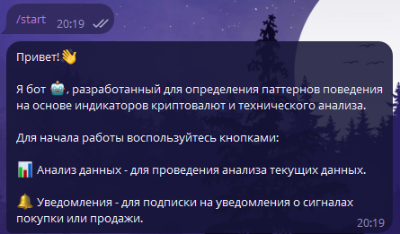
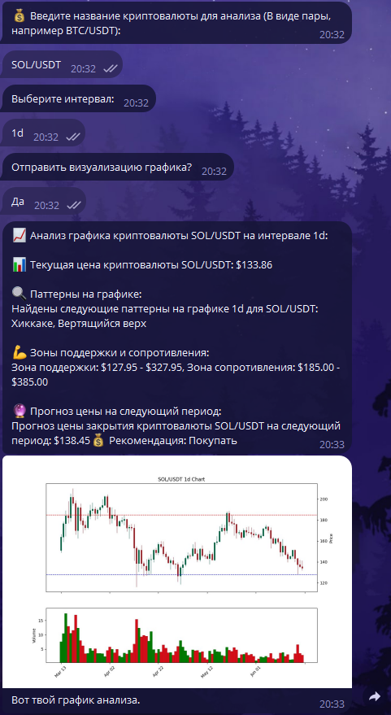
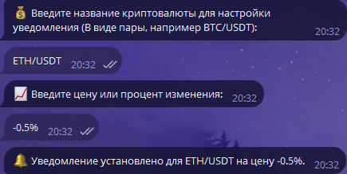

# 📈 CryptoAnalyzerBot — Анализ криптовалют и уведомления 🚀

CryptoAnalyzerBot — это мощный бот для Telegram, который анализирует криптовалюты, строит графики, предоставляет технические данные и новости, а также отправляет уведомления при достижении указанных цен. Создан для удобного взаимодействия с криптовалютными рынками прямо через Telegram.

## 📑 Содержание

1. [Системные требования](#системные-требования)
2. [Технологии](#технологии)
3. [Инструкции по установке](#инструкции-по-установке)
4. [Обзор функциональности](#обзор-функциональности)
5. [Сценарии взаимодействия с пользователем](#сценарии-взаимодействия-с-пользователем)

---

## 🖥️ Системные требования

- **Операционная система**: Windows, macOS или Linux
- **Версия Python**: 3.9 или выше
- **Библиотеки**: Перечислены в файле `requirements.txt`

---

## ⚙️ Технологии

Проект построен с использованием следующих технологий:

- **Aiogram** — Библиотеки для асинхронной работы с Telegram API.
- **Pandas** — Библиотека для обработки и анализа данных.
- **TA-Lib** — Библиотека для технического анализа финансовых данных.
- **Scikit-Learn** — Библиотека для машинного обучения, включающая модели регрессии и методы оценки.
- **Matplotlib и Mplfinance** — Инструменты для визуализации данных и финансовых графиков.
- **CCXT** — Библиотека для работы с криптовалютными биржами и API.
- **Binance API** — Интерфейс для взаимодействия с криптовалютной биржей Binance.
- **MySQL** — Реляционная база данных для хранения данных проекта.

## 🔧 Инструкции по установке

1. Клонируйте репозиторий:
   ```bash
   git clone https://github.com/your-username/CryptoAnalyzerBot.git
   ```

2. Перейдите в каталог проекта:
   ```bash
   cd CryptoAnalyzerBot
   ```

3. Создайте виртуальное окружение:
   ```bash
   python -m venv venv
   ```

4. Активируйте виртуальное окружение:
   - На Windows:
     ```bash
     venv\Scripts\activate
     ```
   - На macOS/Linux:
     ```bash
     source venv/bin/activate
     ```

5. Установите необходимые библиотеки:
   ```bash
   pip install -r requirements.txt
   ```

6. Настройте переменные среды:
   ```bash
   export TELEGRAM_TOKEN=your-telegram-bot-token
   export DATABASE_URL=your-database-url
   ```

7. Запустите бота:
   ```bash
   python bot.py
   ```

---

## ⚙️ Обзор функциональности

CryptoAnalyzerBot предлагает следующие функции:

- 📊 **Технический анализ криптовалют**: Анализирует данные криптовалюты и предоставляет подробные отчеты.
- 📉 **Визуализация данных**: Строит графики для наглядного анализа рыночных тенденций.
- 📢 **Уведомления о ценах**: Настраиваемые оповещения при достижении заданных ценовых уровней.
- 📰 **Новости криптовалют**: Получайте актуальные новости из мира криптовалют.
- 🔄 **Обработка пользовательских команд**: Взаимодействуйте с ботом через команды для мгновенного анализа и получения информации.

---

## 🛠️ Сценарии взаимодействия с пользователем

### 1. Запуск бота и базовые команды

- **Сценарий: Запуск бота**
  - Пользователь вводит команду `/start`, и бот приветствует его, предоставляя основные функции для работы.
  - 

- **Сценарий: Получение справки**
  - Команда `/help` предоставляет список доступных команд и описание их функциональности.
  - 

---

### 2. Анализ данных и визуализации

- **Сценарий: Технический анализ криптовалюты**
  - Пользователь выбирает функцию анализа с помощью команды `📊 Анализ данных`.
  - Бот запрашивает название криптовалюты и временной интервал для анализа.
  - В результате бот предоставляет отчет с графиком или без, в зависимости от выбора пользователя.
  - 

---

### 3. Уведомления и новости

- **Сценарий: Настройка уведомлений**
  - Пользователь задает пару валют и желаемую цену для отслеживания.
  - Бот отправляет уведомление при достижении указанной цены.
  - 

- **Сценарий: Получение новостей**
  - Команда для получения свежих новостей по выбранной криптовалюте.
  - Бот предоставляет последние новости из надежных источников.
  - 

---

## 📬 Связь

Если у вас возникли вопросы или предложения, пишите на 📧 [email@example.com](mailto:email@example.com).

---

**CryptoAnalyzerBot** — ваш помощник в мире криптовалют! 🚀
